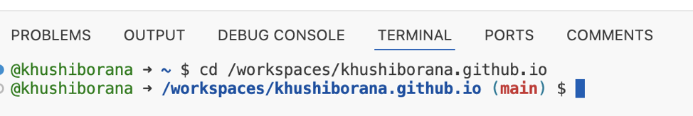
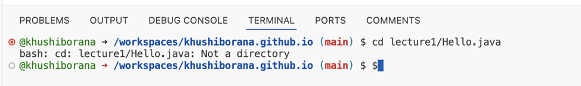
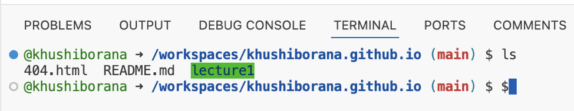
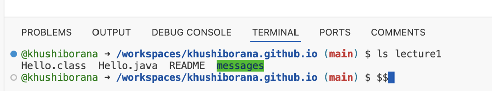
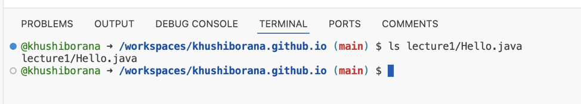
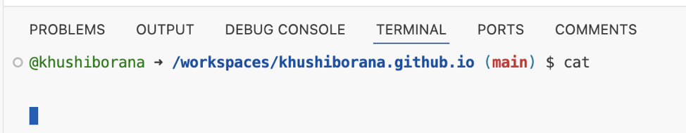
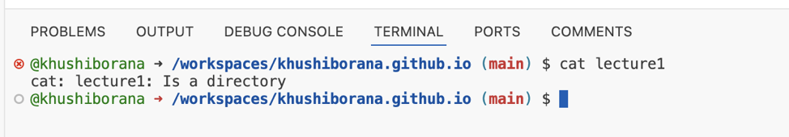
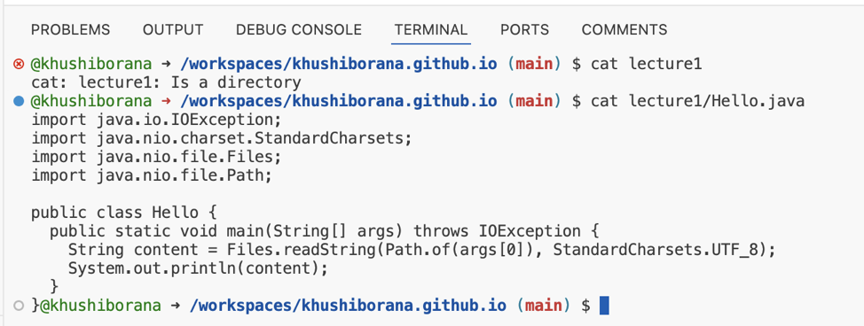

  
@khushiborana ➜ /workspaces/khushiborana.github.io (main) $  
The command did not change the directory because the directory name was not specified in the command as an argument.  
Not an error because we did not specify anything to be changed to  

@khushiborana ➜ /workspaces/khushiborana.github.io (main) $  
The command changed the directory to lecture1 as we had specified that as an argument  
Not an error because the command executed successfully  

@khushiborana ➜ /workspaces/khushiborana.github.io (main) $  
The command did not change the directory because we specified a path as an argument instead of directory name  
It was an error because the command 'cd' requires the argument to be a directory name, not a path  

  
@khushiborana ➜ /workspaces/khushiborana.github.io (main) $  
The command gave us the list of all the files under home directory  
Not an error because we got the desired output of all the files in the home directory  

@khushiborana ➜ /workspaces/khushiborana.github.io (main) $  
The command gave us a list of all the files under directory lecture1  
Not an error because the command executed successfully in listing all files under lecture 1 as seen in the output  

@khushiborana ➜ /workspaces/khushiborana.github.io (main) $  
The command lists the name of the file itself because 'ls' expects directory as an argument but we have given the path of a file name as an argument  
It was not an error but it did not list the file names because 'ls' expects directory as an argument but we have given the path of a file name as an argument 

  
@khushiborana ➜ /workspaces/khushiborana.github.io (main) $  
The command 'cat' did not give any output because it expects a file as an argument  
Not an error but we did not get the desired output because 'cat' expects a file as an input in order to list out its contents  

@khushiborana ➜ /workspaces/khushiborana.github.io (main) $  
The command 'cat' gave us an error that said that it is a directory because it expects a file as an input  
It is an error because it expects a file to be in the argument so that its contents can be listed  

@khushiborana ➜ /workspaces/khushiborana.github.io (main) $  
The command 'cat' lists the contents of Hello.java   
It was not an error because we got the contents of the file 'Hello.java' as desired  
