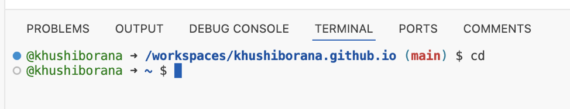

  
@khushiborana ➜ /workspaces/khushiborana.github.io (main) $  
The command did not change the directory because the directory name was not specified in the command as an argument
Not an error because we did not specify anything to be changed to

@khushiborana ➜ /workspaces/khushiborana.github.io (main) $
The command changed the directory to lecture1 as we had specified that as an argument
Not an error because the command executed successfully 

@khushiborana ➜ /workspaces/khushiborana.github.io (main) $
The command did not change the directory because we specified a path as an argument instead of directory name
It was an error because the command 'cd' requires the argument to be a directory name, not a path 

